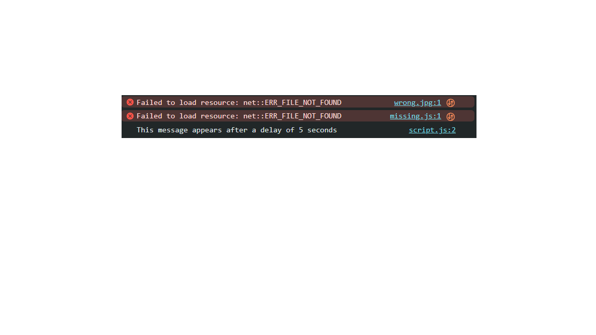

# Browser Debug Demo

This project is a simple web page with intentional errors created to practice **browser debugging** using Chrome DevTools.  
It demonstrates how technical support engineers identify and fix issues in **web applications and SaaS environments**.

---

## 🔹 Features
- Missing image reference
- Broken JavaScript file
- Slow-loading script (delayed execution)
- Console errors and network failures

---

## 🔹 Files
- `index.html` → Contains broken image, broken script, and references to slow script
- `script.js` → Contains delayed execution script
- `missing.js` → Intentionally missing file (to trigger error)

---

## 🔹 How to Use
1. Open `index.html` in Chrome (or any browser).
2. Open **DevTools** (F12 or Ctrl+Shift+I).
3. Check:
   - **Console tab** → JavaScript errors (missing file).
   - **Network tab** → Failed requests (404 for missing image and JS).
   - **Performance** → Delay caused by slow script.

---

## 🔹 Debugging Steps
1. Identify the missing image error → fix by pointing to a correct file.
2. Remove or replace the broken script (`missing.js`).
3. Optimize the slow-loading script.

---

## 🔹 Why This Project Matters
Support engineers often need to debug **browser-related issues** reported by users.  
This demo simulates real-world scenarios where:
- Web apps fail due to broken resources
- Performance is impacted by inefficient scripts
- Users encounter console errors

By practicing on this demo, one gains familiarity with DevTools and improves their troubleshooting workflow.

---

## 🔹 Example Screenshot

---

👨‍💻 Author: **Raghav Yadav**  
📌 GitHub: [beingralph](https://github.com/beingralph)
